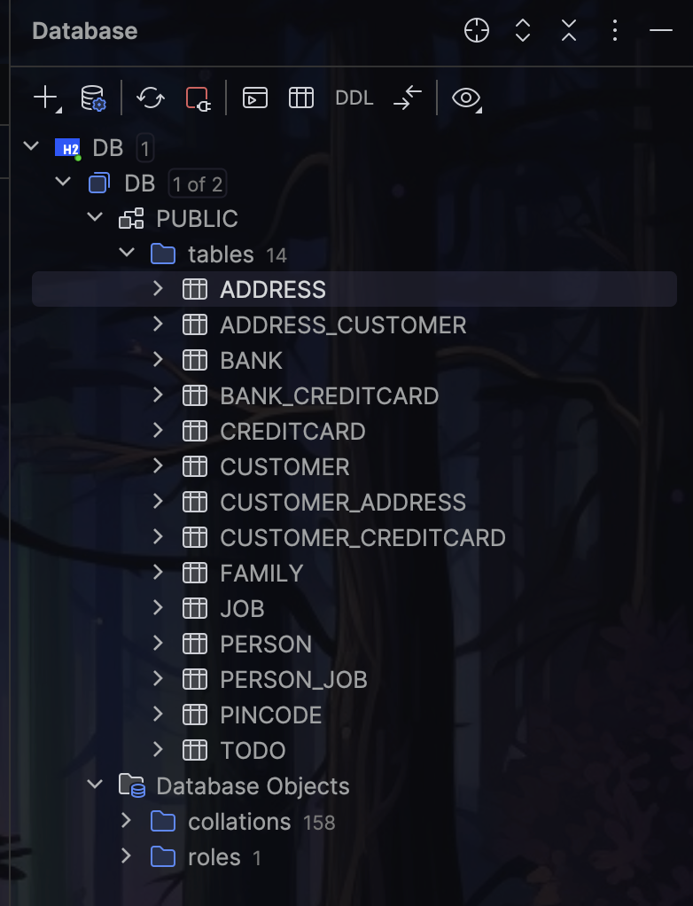

## Expass 4

#### Technical Problems Encountered
I did not encounter any issues during the installation and use of JPA for this assignment.

#### Link to Code

This is the link to the code for [expass4](https://github.com/MinaTolfsen/expass4-jpa-tutorial).

#### Inspecting the Database Tables

I inspected the database tables by opening the Database tool window in IntelliJ (`View` – `Tool Windows` – `Database`). Then, I pressed `command + n` to select the path I wanted to connect to within my project files. I connected it to the file `DB.mvn.db` located in my project directory. After this, I clicked on the database that was created, selected **Diagnostics**, and then **Refresh**. This gave me the following results:

##### Database overview


##### Database address


#### Pending issues

I believe I successfully completed all tasks for this submission. I’m a little unsure about the database part, but it seems to align with the code.


### Questions
1. Explain the used database and how/when it runs.

The database used for this project is an **H2 in-memory database**. It starts automatically when the application runs and stores all data in memory, making it useful for testing and development. Since it’s in-memory, the data is cleared when the application stops.

2. Can you provide the SQL used to create the table Customer?
    
```sql
    CREATE TABLE Customer (
        id BIGINT AUTO_INCREMENT PRIMARY KEY,
        name VARCHAR(255),
  );
```
I assume that addresses and creditCards are handled by the ManyToMany relationships, and therefore, I did not include them in the SQL statement.

3. Find a way to inspect the database tables being created and create a database schema in your report. 

Explanation is provided in the text above.

4. Do the created tables correspond to your initial thoughts regarding the exercise?

Yes, the tables correspond to my initial thoughts. I expected the tables to be created in the database, and they were. I also expected the tables to be created with the correct columns, which they were.