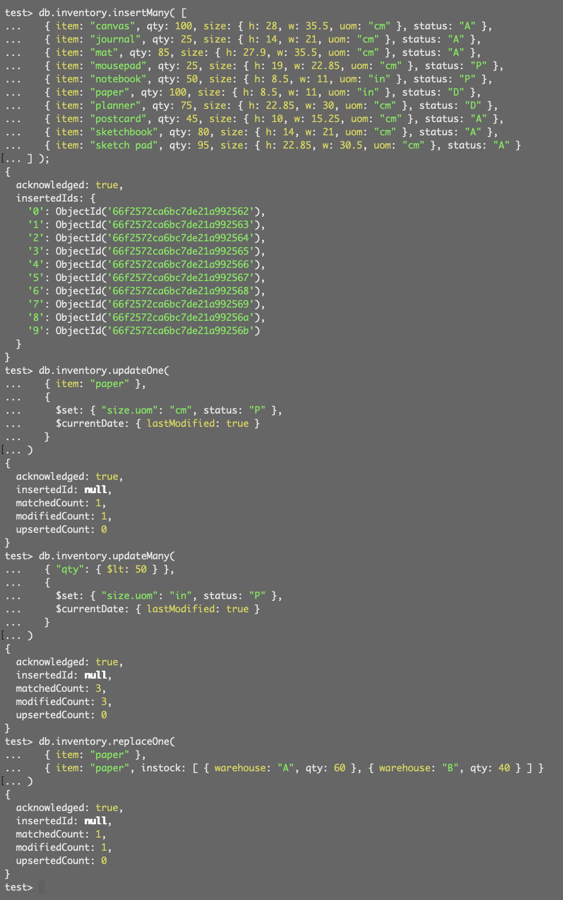

## Expass 5

### Technical Problems Encountered
I did not encounter any issues during the installation and use of MongoDB for this assignment.

### Installation package
#### MongoDB

### Experiment 1: MongoDB CRUD operations
#### Insert documents:

#### Query documents:

#### Update documents:

#### Remove documents:

### Bulk write operations

### Experiment 2: Aggregation
#### Experiment 2 tutorial

#### Additional operations developed by me

### Wht the Map-Reduce Operation is useful
The implemented Map-Reduce operation calculates the average order price for each customer by aggregating their total spending and the number of orders. This operation is particularly useful for analyzing customer behavior in terms of purchasing habits. 

- Identift high-value customers based on their average spending per order. For example, customers who spend more than the average order price could be considered high-value customers for the business.
- Segment customers based on their average spending per order. By grouping customers into different segments based on their average order value, the company can tailor marketing strategies and promotions to each segment.
- Spot order trends and patterns based on the average order price. If the average order value increases over time, it could indicate that customers are purchasing more expensive items or that the company has increased prices.

### Interpreting the Collection Obtained
The resulting collection from the Map-Reduce operation looks like this:

- Ant O. Knee placed 2 orders, spending a total of 95, with an average order price of 47.5.
- Busby Bee placed 3 orders, spending a total of 125, with an average order price of 41.67.
- Cam Elot placed 2 orders, spending a total of 60, with an average order price of 30.
- Don Quis placed 3 orders, spending a total of 155, with an average order price of 51.67.

This collection provides valuable insights into customer behavior and purchasing habits. For example, it shows that Don Quis is a high-value customer, spending an average of 51.67 per order, while Cam Elot is a low-value customer, spending an average of 30 per order.

### Pending issues
No pending issues for this assignment.