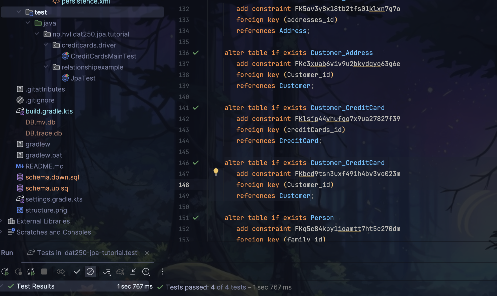
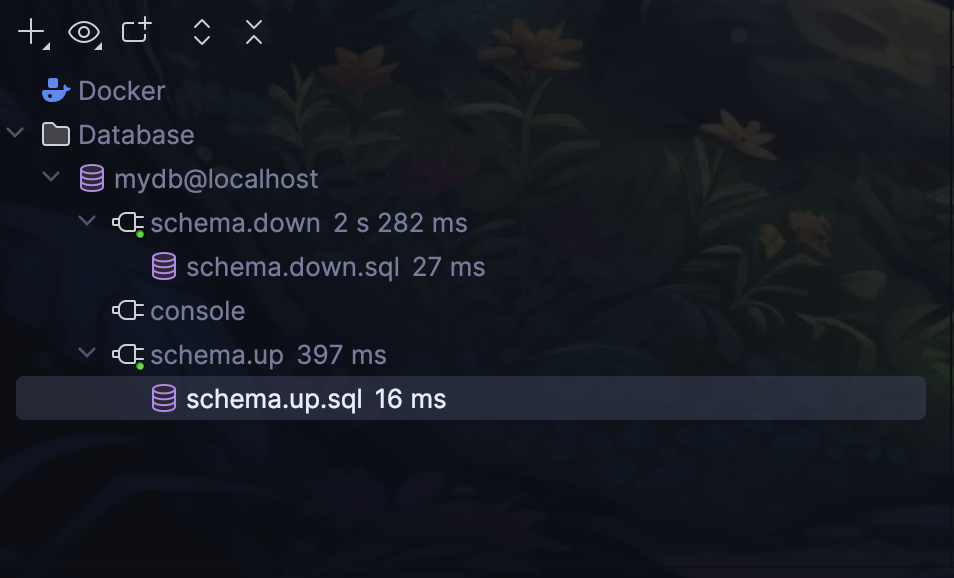
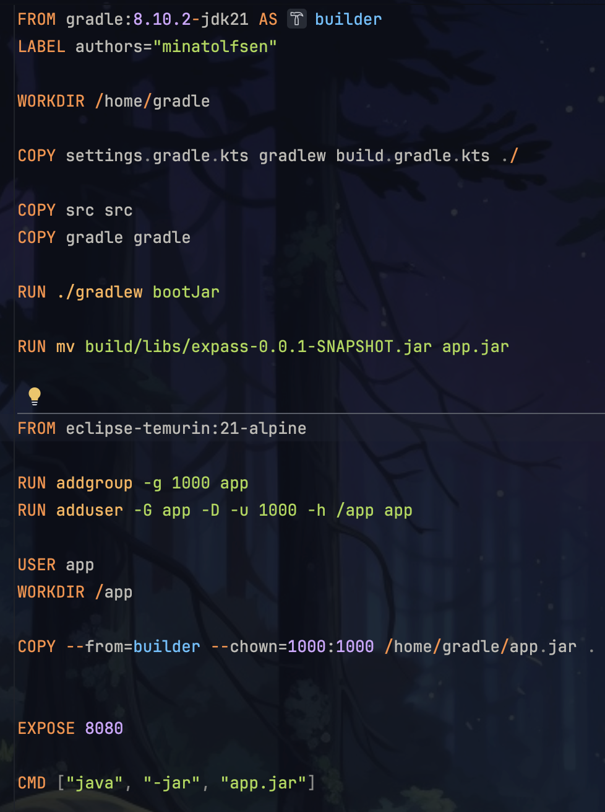

## Expass 7

### Using a Dockerized application: PostgreSQL
The Unit tests can be run just as before with the PostgreSQL database in the background instead of the H2 database.

### Building you own dockerized application
The docker container is built with the following command:
- `docker build -t image`

The container is then run with the following command:
- `docker run -d -p 8080:8080 --name myapp-container image`

This is the Dockerfile used to build the container.

[Dockerfile](https://github.com/MinaTolfsen/expass3/blob/main/Dockerfile)